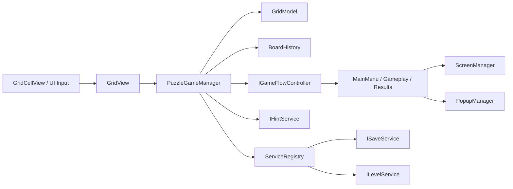
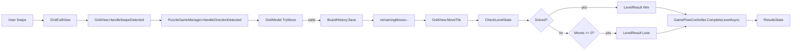
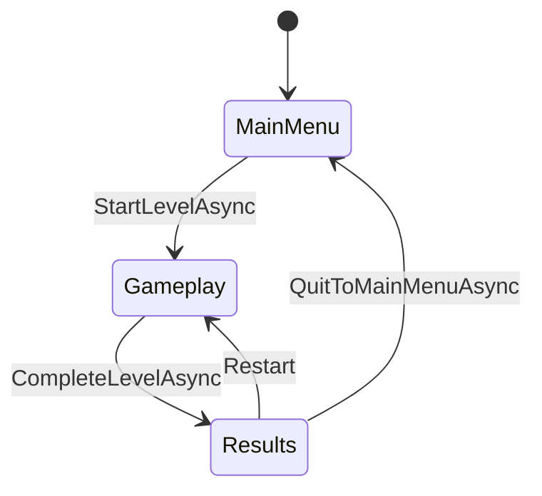
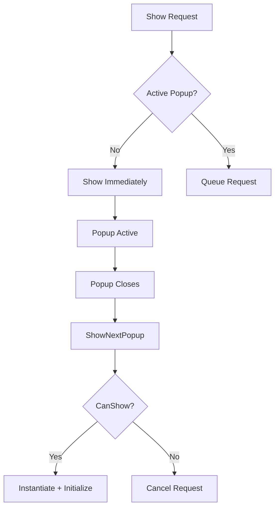

# Grid Puzzle Challenge

Technical README for the Grid Puzzle Challenge implementation.

## Overview

This project is structured around a strict separation between logical puzzle state, gameplay orchestration, UI rendering, application flow, and supporting services.

The core rule is:

> **GridModel owns the truth. Views visualize it. Controllers coordinate it.**

## Architecture



## Functional Code Flow



## Core Modules

### `Puzzle.Gameplay.Grid`

**GridModel**
- Stores the logical `int[,]` matrix.
- Uses `EmptyCell = -1`.
- Validates positions.
- Executes valid tile moves.
- Tracks empty positions.
- Supports undo.
- Checks the solved state.

**GridPosition**
- Immutable row/column value type.
- Implements equality and hashing.

**GridDirection**
- `Up`
- `Down`
- `Left`
- `Right`

### `Puzzle.Gameplay.Grid` - Rendering

**GridView**
- Builds cell views from the logical model.
- Converts swipe vectors into discrete directions.
- Converts grid coordinates into centered local positions.
- Animates moved tiles with LeanTween.

**GridCellView**
- Captures pointer down/up positions.
- Detects swipe distance.
- Displays tile values.

## Movement Mathematics

For a tile at `(row, column)`:

```text
Up    = (row - 1, column)
Down  = (row + 1, column)
Left  = (row, column - 1)
Right = (row, column + 1)
```

A move succeeds only if the target coordinate is inside the board and contains `EmptyCell`.

## Board Position Mathematics

For a board with `rows`, `columns`, `cellSize`, and `spacing`:

```text
totalWidth  = columns * cellSize + (columns - 1) * spacing
totalHeight = rows * cellSize + (rows - 1) * spacing

startX = -(totalWidth - cellSize) * 0.5
startY =  (totalHeight - cellSize) * 0.5

x = startX + column * (cellSize + spacing)
y = startY - row * (cellSize + spacing)
```

The first step calculates the complete board size. The second step finds the centered starting point. Each following cell is offset by `cellSize + spacing`.

## Swipe Mathematics

```text
swipeDelta = pointerUpPosition - pointerDownPosition
```

If:

```text
|swipeDelta| < 50
```

the gesture is ignored.

Otherwise:

```text
|x| > |y|  -> horizontal
|y| >= |x| -> vertical
```

The sign determines the direction.

Example:

```text
x = 120
y = 40

|120| > |40|
-
-> horizontal
-> Right
```

## Undo

Each successful move creates:

```text
BoardMove
    MovedValue
    PreviousPosition
    TargetPosition
```

Moves are stored in a stack:

```text
Move A
Move B
Move C  <- newest

Undo() -> C is removed first
```

Undo then restores:

```text
TargetPosition   -> EmptyCell
PreviousPosition -> MovedValue
```

The move counter is also incremented.

## Level Generation

`ShuffleLevelGenerator` starts from a solved board and performs legal random moves.

Process:

1. Pick a random direction.
2. Reject the direct opposite of the previous direction.
3. Ask `GridModel` to perform the move.
4. Retry if the move is illegal.
5. Repeat for `moveCount`.

Because every shuffle step is a legal move from the solved state, the resulting position is reachable from the solved layout.

## Hint System

`HintService` uses the exact shuffle history generated when the level is created instead of performing a general-purpose board search.

`ShuffleLevelGenerator` starts from the solved board and performs legal moves. Every accepted shuffle move is stored as a `BoardMove` and exposed through `ShuffleMoves`.

Because every shuffle move is legal and reversible, reversing the recorded shuffle sequence provides a guaranteed solution path back to the solved board.

### Generated Solution

If generation performs:

```text
A -> B
B -> C
C -> D
```

the hint solution is:

```text
D -> C
C -> B
B -> A
```

The hint service starts from the last generated shuffle move and works backwards through the sequence.

### Player Deviations

The player does not have to follow the generated solution.

If the player makes a different move, `HintService` stores that move as a deviation.

```text
Expected solution
A -> B

Player
A -> X
X -> Y

Hint
Y -> X

Hint
X -> A

Solution resumes
A -> B
```

Multiple deviations are handled in reverse order. The most recent deviation is reversed first, then the previous deviation, until the generated solution can resume.

### Hint State

`HintService` maintains:

```text
shuffleMoves
solutionIndex
playerMoves
deviationMoves
```

`solutionIndex` identifies the next generated shuffle move that must be reversed.

`playerMoves` records successful gameplay moves.

`deviationMoves` contains moves that diverged from the expected generated solution.

### Move Registration

Every successful move is registered with the hint service:

```text
IHintService.RegisterMove(BoardMove)
```

Undo registers the removal of the latest player move:

```text
IHintService.RegisterUndo()
```

This keeps hint state synchronized with `BoardHistory` and the logical `GridModel`.

### Complexity

The hint system does not perform graph search or maintain a search tree.

Hint state recalculation processes the recorded player moves:

```text
O(N)
```

where `N` is the number of player moves.

Since the level has a bounded move limit, the work is small and predictable.

## Game Flow



`GameFlowController` owns:
- Current state
- Current level context
- Current level result
- State transitions

## Screen Management

`ScreenManager` supports three screen types:

### Exclusive
Replaces existing screens.

### Modal
Can appear over an Exclusive screen. The Exclusive screen is hidden and restored later.

### Additive
Can stack with Modal/Additive screens, but is rejected over an Exclusive screen.

## Popup Management

`PopupManager` guarantees one active popup at a time.



## Persistence

`ISaveService` abstracts integer persistence:

```text
SaveInt(key, value)
LoadInt(key, defaultValue)
HasKey(key)
```

`PlayerPrefsSaveService` implements this using Unity `PlayerPrefs`.

On a Win, `ResultsState` loads `CurrentLevel` and saves the next level number.

## Level Data

`LevelData` is a `ScriptableObject` containing:

```text
LevelNumber
Rows
Columns
EmptySpaces
MoveLimit
```

The flow is:

```text
LevelData asset
    |
LevelService.GetLevel()
    |
MainMenuScreen
    |
GameFlowController.StartLevelAsync()
    |
LevelContext
    |
GameplayState
    |
GameplayScreen
    |
PuzzleGameManager.Initialize()
```

## Move Counter

The UI normalizes remaining moves to a 0-1 progress value:

```text
progress = 1 - remainingMoves / totalMoves
```

Examples:

```text
Start:
remaining = total
progress = 0

No moves left:
remaining = 0
progress = 1
```

That normalized value is used to interpolate the displayed color from green toward red.

## Performance Notes

- `GridView` animates only the moved tile rather than rebuilding the whole board.
- `GridModel` maintains `emptyPositions`, avoiding unnecessary full-grid searches for movement.
- `BoardHistory` stores move deltas rather than complete board snapshots.
- `ShuffleLevelGenerator` records the legal moves used to create the level.
- `HintService` reuses the generated solution instead of searching the puzzle state space.
- Player deviations are tracked as lightweight `BoardMove` entries.
- Hint state recalculation is `O(N)`, where `N` is the number of player moves.
- There is no per-frame hint processing, priority queue, search tree, or background solver.

The hint system deliberately uses information already available from level generation. This makes hint computation predictable and avoids solving a state space that the generator has already provided a valid path through.

